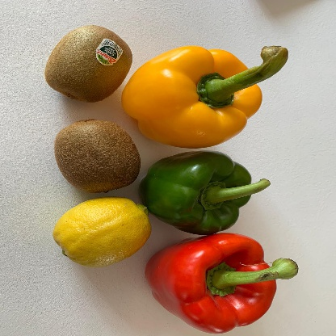
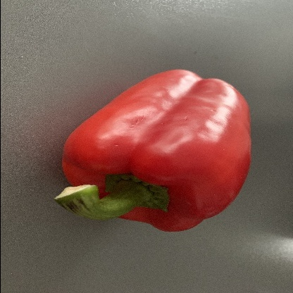
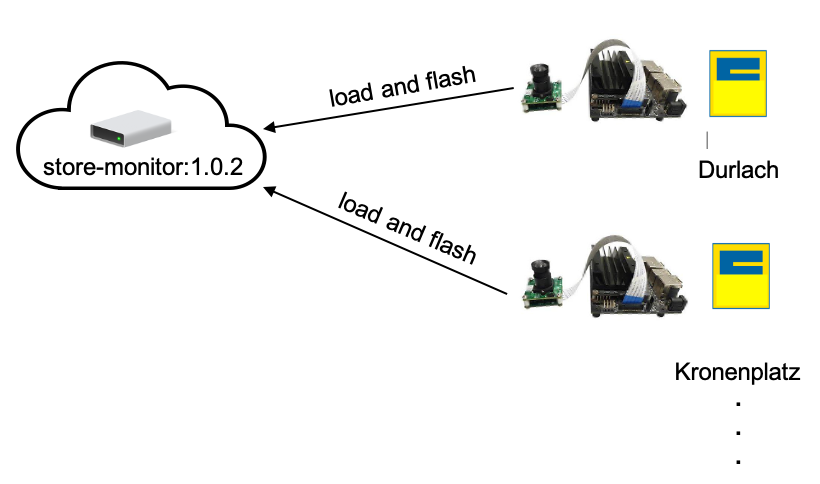
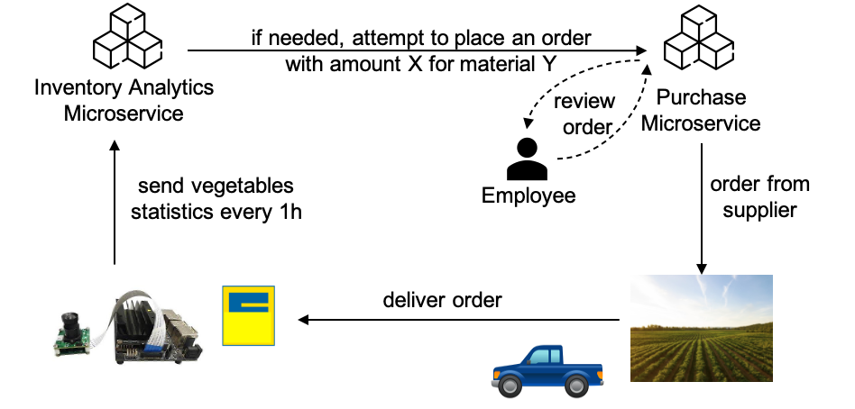

  


# Detection of Bell Peppers and Kiwis in Video Data Using TinyYoloV3

The following report describes the practical project for the lecture "Service Analytics" at 
Karlsruhe Institute of Technology (KSRI) in summer term 2020. The aim of the project was 
to implement a CNN-based detector for bell peppers and kiwis deployed on the NVIDIA Jetson Nano. 
This documentation starts off with a quick-start guide and concludes with more elaborate descriptions about
the different project and implementation stages. The following should help you to understand the 
individual steps of data acquisition, model building, evaluation and deployment. The document is structured 
along the CRISP-DM model including the following sections:

1. [Introduction and Quick-Start Guide](#introduction)  
2. [Business and Data Understanding: Project Plan and Responsibilities](#business-understanding-and-use-case)
3. [Data Understanding: Data Acquisition, Labelling and Preprocessing](#data-acquisition-and-labelling)
4. [Model Building and Training](#network-architecture-and-setup-tiny-yolo-v3)
5. [Deployment on NVIDIA Jetson Nano](#nvidia-jetson-nano)
6. [Conclusion and Summary](#conclusion-and-summary)
7. [References](#references)

## Introduction

The challenge of this year's group work in the lecture "Service Analytics" was to build a computer vision prototype
that could detect selected objects in images and video and to deploy it on the NVIDIA Jetson Nano. The group members had to 
fulfill all steps necessary in this process such as definition of use-case, image acquisition and labelling, data preprocessing, 
model building and training as well as evaluation and deployment. Requirements for the project had been using Python as programming language,
building on open source code (such as Tensorflow or Keras) and using CNN architectures with predefined weights (such as Yolo, ImageNet etc.).
Code-sharing and documentation was done in Git.

The repository for this project follows the structure shown in the next chart.

```
├── LICENSE           
├── README.md          
│
├── data                    <- Different stages of the data (raw, clean, processed,...).
│
├── docs                    <- Images for README.
│
├── models                  <- Trained and serialized models, model predictions, or model summaries.
│
├── notebooks               <- Jupyter notebooks such as for TensorRT, inference and training.
│
├── scripts                 <- Helper scripts e.g. for camera testing and .json verification.
│
├── requirements.txt        <- Requirements for reproducing the analysis environment on a local computer using webcam.
├── requirements_nano.txt   <- Requirements for reproducing the analysis environment on the Jetson Nano.
├── .gitignore 
│
└── src                     <- Source code for use in this project. Structured into different submodules.
```

### Quick-Start Guide

The detector can both be deployed on the Jetson Nano as well as on a standard notebook using a built-in webcam. 
For deployment on the Jetson Nano we recommend to read and apply the steps as described later in this documentation 
due to the time-consuming and costly setup process.

We are using Python 3.7 (Tensorflow 1.15, Keras 2.2 and OpenCV 4.2) for our project. For deployment on a notebook computer, 
first install all necessary packages using `pip`. For the detailed setup procedure of the Jetson Nano please 
see the following link [Jetson Nano](#nvidia-jetson-nano). We recommend to use virtual environments in order to avoid any
package conflicts.
```
pip install -r requirements.txt
````

The detector can be started in the `Paprika-Detector.ipynb` notebook that can be found in the `notebooks` folder. 
Before loading the model, we will set the variables `using_nano_camera` and `detect_on_space_keystroke` that will define 
the inference mode.
```python
using_nano_camera = True
detect_on_space_keystroke = True
```
These two variables define whether the detection will be carried out on a notebook computer with built-in webcam or on the Jetson-Nano.
Furthermore, we can set the detection mode either to triggered by keystroke or real-time in-video detection.

|  | `using_nano_camera` | `detect_on_space_keystroke` |
| ------ | ------ | ------ |
| True | performs detection on Jetson Nano using CSI camera | performs detection triggered by keystroke of space key |
| False | performs detection on notebook computer using built-in webcam | performs real-time in-video detection (at low fps) |

Afterwards, we can instantiate the model, define some additional video- and detection-based functions and start streaming.
```python
model = TinyYoloV3(path=model_path)
# ... some user-defined functions ...

# start streaming
if detect_on_space_keystroke:
    show_camera_keystroke(cap)
else:
    show_camera(cap)
```

Congratulations, you should now be able to detect and classify bell peppers and kiwis with your webcam!

### Results/Benchmark

The performance we could achieve with our model is far from the benchmarks that NVIDIA is providing for the same kind of network. The utmost frame rates we could 
get have been in the range of 3-5fps using TensorRT. Inference on the GPU did not yield any improvements, not to mention any stable performance at all. A more detailed 
summary on the achieved performance is given in the corresponding section at the end of this document.

### Project-Plan and Team-Roles

The project was scheduled from May to August 2020 and followed the CRISP-DM methodology although some steps ran in parallel to allow a reasonable distribution of workload.
Each team member took a specific role, namely project manager/Scrum master, data/business analyst, data engineer, data scientist, 
architect and software engineer.

The following chart shows the project schedule along the relevant milestones that were planned in advance.

<div align="center">

</div>

Each step is now described in more depth.

## Business Understanding and Use-Case

The detection and localization of fruit and vegetables with the help of computer vision offers various application possibilities. 
In this project we focused on four use-cases. For the first one, the inventory management and purchase automation, this implementation serves as a first prototype.

#### Inventory Management and Purchase Automation in Supermarkets

Fresh fruits and vegetables are a challenging retail category because of fast spoilage. Excess inventory is a major driver for spoilage while being 
out of stock is equally less desirable. Therefore, the exact knowledge about inventories and accurate predictions are key for successful inventory management. 
The detection of fresh produce offers the real-time tracking of inventories and even their degree of ripeness. This allows supermarket owners to calculate optimal 
order quantites and schedules and place automated orders, to reduce waste of fresh produce and unsatisfied customers. Our prototype first offers only the detection of bell peppers and kiwis 
but could be extended to count inventories and for the classification of the degree of ripeness (e.g. phase 1 - near raw, green bananas, phase 2 - ripe, perfect to eat, 
phase 3 - near spoiled, brown bananas). Besides the usage for an automated inventory and procurement system, this data could also be used to realize an automated check-out process for customers without cashiers.
Together with more monitoring systems, like the detection of persons and the analysis of their activities, the purchased goods can be tracked and automatically payed
when walking out of the grocery store. This process is already realized in Amazon-Go shops and can be considered as trend for future supermarkets.

#### Monitoring of Agricultural Greenhouses

Smart greenhouses include various sensors such as temperature, humidity and light sensors to allow an optimal growth environment for plants. Installing a moveable 
camera, that can be fixed to a rail at the ceiling, allows to monitor the growing process even better. The quantity of growing fruits, possible diseases of the plants
or a pest infestation can be recognized. By combining the camera with a picking robot, it is also possible to develop an automated picking process, that yet was only
possible by humans.

#### Support for Visually Impaired People

Visually impaired people often have a sharp sense of touch and can identify objects by touching them. Objects that are far away are difficult to find. Our prototype can
help to locate fruits for example on a market and navigate people to the correct location. Together with smart lenses the object detection could be used in this use-case.

#### Learning Application for Children

One huge challenge for computer vision models is the acquisition of training data. Developing a playful app for children, in which they can identify objects during gaming,
enables collecting labeled images. To ensure the correct label, a rule, e.g. that the label is assumed to be true, if 10 children label it that way, can be implemented.
This gamified labeling approach reduces the labeling effort. There are already many existing apps for children with games around fruits and vegetables available, which 
supports the idea.

## Data Acquisition and Labelling

The data set for training our model was acquired by taking pictures of bell peppers and kiwis mainly with smartphone cameras in high resolution mode. 
Labeling of these pictures was done using the [VGG Image Annotator](https://www.robots.ox.ac.uk/~vgg/software/via/via-2.0.5.html).
Several preprocessing and augmentation methods were implemented in order to bring the images into the required format and to enhance training. 
The following subsections describe these steps more detailed.  

### Data Labelling

The goal was to collect a diverse and sufficiently large data set to ensure performant object detection in a live video stream. 
Therefore, each group member took around 200 images of bell peppers and kiwis - so overall, our data set contains about 1200 images. 
They can be found in the `data` folder. Since we want to do multi-object detection, we not only took pictures of single 
bell peppers or kiwis, but also of multiple objects in one picture. Additionally, the pictures were taken in different settings and domains
(different angle, different lighting conditions, cut in half) and next to other fruits that look similar. For instance, kiwis could 
be photographed together with lemons, eggs or avocados; bell peppers next to tomatoes.  

<div align="center">
    <tr>
        <td>  </td>
        <td>  </td>
    </tr>
</div> 

After agreeing on conventions on how to store the images, which formats to use and how to name the region attributes, the 
labeling process started. As mentioned earlier, labelling of the acquired data was done using the [VGG Image Annotator](https://www.robots.ox.ac.uk/~vgg/software/via/via-2.0.5.html).
Its application is very intuitive. The only prerequisite is to set a region attribute and corresponding IDs (representing potential object classes). 
Then you can simply add files via mouse click and label the images by drawing bounding boxes around the region 
of interest. We tried to fit these bounding boxes as close to the bell peppers and kiwis as possible to enable a better training.
These annotations can be exported either as `.csv` or `.json`. In this project, the JSON export was used. The VGG Image Annotator 
also allows labelling in small batches, so one does not have to do everything at once. This can be done by importing 
previously stored annotations. Then, new images can be added, labelled and *all* annotations can be exported into the same
JSON again. This made the labelling process a lot easier. In order to avoid any issues with the nomenclature of the images during training we have
come up with the following convetions.

* Naming convention for images: prefix for user + "\_" + index + "\_" + label1 (+ "\_" + label2)
  * user: 3-characters --> Timo: "tim", Felix: "fel", Katharina: "kat", Aileen: "ail", Mohamad: "moh", Lukas: "luk"
  * index: 3-digit integer (index ascending for each image)
  * label1/label2: 3-characters --> Paprika: "pap", Kiwi: "kiw"; if both then Paprika first
  * file format: .jpg

This system allows a uniform designation without name conflicts.

### Data Preprocessing and Augmentation

In this project, several image pre-processing, augmentation and post-processing methods were implemented using mostly `OpenCV`.  
These methods can be found in the `preprocessing.py` file in the `src` folder. Additionally, jupyter notebooks are provided 
in the `notebooks` folder, which show the application and allow testing of the preprocessing and augmentation methods.

Overview of *preprocessing* methods: 
- JSON utils to extract the annotations
- Resizing for downscaling the image 
- Grayscaling the images (with options for thresholding or histogram equalization)

The JSON utils contains *reading* the annotations of the images, which were exported from the VGG Image Annotator as `.json` and 
*writing* the preprocessed image and bounding box information into one Master-JSON. Since each group member labelled the images he or she had acquired, 
there were several JSON files containing the annotations, so additionally there is a method for *merging* several JSON files.  

The preprocessing methods that we apply for our model can be found in the `Image Preprocessing.ipynb` in the `notebooks` folder. 
First, we read and merge the JSON annotations with the described utils. Then, we downscale every image to 416x416, which 
is the required input format for the YOLO net and adapt the bounding box coordinates accordingly.  
There are some grayscaling options available in this notebook, which we implemented in the beginning of our project 
but ultimately don't use. We decided to work with colored images, because we applied transfer learning and the transferred weights
were also trained on color images. In addition to that, information on color might be quite valuable for our use case, 
for example to be able to distinct kiwis from lemons. However, if you want to try out grayscaling and thresholding or 
histogram equalisation (e.g. to increase contrast), simply set the following booleans in the `Image Preprocessing` notebook.

```python
# Set this variable to True to convert all images to grayscale images
convert_to_grayscale = True
# for preprocessing with histogram equalization set this variable to True
should_equalize_histogram = True
# for preprocessing with thresholding set this variable to True
thresholding = False
```

Several image augmentation methods should help us to artificially increase our training data set to further improve the generalization performance
of our model. Similar to the other preprocessing methods, they are implemented in the `preprocssing.py` file in the `src` folder and jupyter 
notebooks are provided to try them out. 

Overview of *augmentation* methods:
- Rotation of images
- Random HSI colour changes
- Random distortion (*'jittering'*) of images

The images can be rotated around their center by an arbitrary angle. For our object detection task, it's not sufficient to
rotate the image, the bounding box coordinates also have to be adapted accordingly. Therefore, the class `Rotation` in the 
preprocessing.py provides two functions, one for rotating the image and one for rotating points. The later is invoked for 
every corner point of the bounding box. Using OpenCV, these rotation functions can be implemented quite easily.
`Image Rotation.ipynb` in the `notebooks` folder allows trying out the rotation implementation. Although it's possible to
rotate by an arbitrary angle, we decided to only use angles of $`90°`$, $`180°`$ and $`270°`$ for training, otherwise the recalculated 
bounding box would no longer fit as close as possible to the region of interest and become excessively large.

<div align="center">
    <table>
        <tr>
            <td> Original </td>
            <td> 90° rotation </td>
            <td> 180° rotation </td>
            <td> 270° rotation </td>
        </tr>
        <tr>
            <td>  </td>
            <td>  </td>
            <td>  </td>
            <td>  </td>
        </tr>
    </table>
</div> 

With random changes to the HSI color space of an image, we try to account for different lighting, saturation and color intensities
that can occur when using the object detector for example at different locations or different times of day. The HSI color space
determines color by hue, saturation and intensity and is therefore better suitable for what we want to achieve than other color
spaces like RGB or BGR. Therefore, we convert the RGB image into HSI, do minor random changes to hue, 
saturation and intensity and convert it back to an RGB image. You can try this out with the `Color-Jittering.ipynb`in the 
`notebooks` folder. The following two pictures show exemplary results.

<div align="center">
    <tr>
        <td>  </td>
        <td>  </td>
    </tr>
</div> 

Last but not least, we implemented random 'distortions' of images. The idea is to account for different shapes of kiwis and
bell peppers. This works the following way: First, we create two random numbers; one scaling factor and one representing 
a new aspect ratio. Depending on the new aspect ratio (smaller or greater than 1), either the image width or height is scaled 
with the randomly generated factor. Then, the other length is adjusted such that the image has the randomly generated aspect 
ratio. Lastly, the image is resized to the required $`416\times 416`$ format. Also, the bounding box coordinates are adjusted accordingly
such that they fit the slightly distorted image. This is realized with the available resizing methods in the `preprocessing.py`. 
You can try this out with the `Jittering-Notebook.ipynb` in the `notebooks` folder.  

<div align="center">
    <table>
        <tr>
            <td> original </td>
            <td> distorted </td>
        </tr>
        <tr>
            <td>  </td>
            <td>  </td>
        </tr>
    </table>
</div> 

**Note**: We do not apply these augmentation methods to all our images before training. Instead, we randomly apply them *during*
training. There is a random data generator that either feeds the original image or an augmented (each with a certain probability)
to the CNN. The advantage is on the one hand that we don't have to store all slightly augmented images and on the other hand 
that the CNN receives randomized images during training, which might prevent overfitting.

### Lessons Learned

- We experienced first hand the effort it takes to acquire and label a sufficiently large data set for computer vision tasks.
- It was very useful to agree on naming conventions right at the beginning of the data acquisition and labeling process, 
to avoid misunderstandings and unnecessary effort in preprocessing. Because when discussing these conventions, it became 
very clear that we all would have done the labelling slightly different (e.g. different names for object attributes, checkboxes 
instead of dropdown). We also labelled on a small subset first to compare the labelling approach in the team for consistency. 
- When acquiring the images, we didn't consider taking only quadratic pictures. This led to the problem of having distortions in the images 
after preprocessing because we resized them to $`416\times416`$. We could solve this issue by adjusting the resizing function to include padding of the image
such that keeping the original aspect ratio was made possible (this feature can easily be set by a boolean token). To check this out, go to the 
'Image Preprocessing' notebook in the `notebooks` folder and set the following boolean.

```python
# Set to True to keep the aspect ratio and pad the image to the required size
keep_aspect_ratio = True
```

## Network Architecture and Setup (Tiny-YOLOv3)

The selection of the appropriate network architectire has heavily been influenced by the Jetson Nano benchmark results provided by NVIDIA at 
[here](https://developer.nvidia.com/embedded/jetson-nano-dl-inference-benchmarks "Jetson Nano Benchmarks"). 
The following table gives an overview on the inference speed of different models on different image sizes. 
We chose the Tiny-YOLOv3 model because it offers a good balance between image size and inference speed on the Jetson Nano. However, we can already point out
that the benchmarks that NVIDIA is providing rather seem to overestimate the real performance on-device. We will further discuss in the corresponding section
regarding the Jetson Nano.


| Model            | Image Size | Framework  | Inference Speed |
|------------------|------------|------------|-----------------|
| SSD ResNet-18    | 960x544    | TensorFlow | 5 FPS           |
| SSD ResNet-18    | 480x272    | TensorFlow | 16 FPS          |
| SSD ResNet-18    | 300x300    | TensorFlow | 18 FPS          |
| SSD Mobilenet-V2 | 960x544    | TensorFlow | 8 FPS           |
| SSD Mobilenet-V2 | 480x272    | TensorFlow | 27 FPS          |
| SSD Mobilenet-V2 | 300x300    | TensorFlow | 39 FPS          |
| Tiny-YOLOv3     | 416x416    | Darknet    | 25 FPS          |

In this chapter, we will now first give a theoretical overview of the Tiny-YOLOv3 model, its architecture, the network-output, and the YOLO loss function. 
After that, we will go into more detail about our implementation. We describe how to train the model and which parameters to choose. 
Inference itself will be described in the next chapter together with the Jetson Nano deployment.

### Theoretical Background

##### Network Architecture of Tiny-YOLOv3

Tiny-YOLOv3 is a smaller version of YOLOv3, the third revision of the YOLO object detection network by Joseph Redmon et al. [[4]](#4)).
Essentially, YOLO is a one-stage algorithm for object detection. In contrast to two-stage approaches, object classes and bounding boxes are predicted 
in a single step. This generally makes them faster than two-stage approaches like (Fast(er)-)R-CNN as the entire detection pipeline is done end-to-end in a
single network. The SSD architecture shown in the benchmarks above also is a one-stage algorithm but with a slightly different approach than YOLO.

The basic intuition behind YOLO is as follows: To detect objects, the image is divided into grid cells and each cell is used to predict an object and 
multiple bounding boxes. The following picture shows the division of an image into $`7\times7`$ grid-cells [[2]](#2). 
In this case, the yellow cell represents the prediction of the class "cat" and a set of bounding boxes (e.g. 20). 

<div align="center">

</div>

Our intuition when selecting the network was to choose a rather small network as there are only few computing resources available at deployment on the Nano.
Therefore, the "tiny" version of YOLO become our model of choice. It contains considerably fewer layers than YOLOv3 and therefore achieves a better real-time performance.
The corresponding network architecture of Tiny-YOLOv3 can be seen in the following figure. [[1]](#1) 
The network mainly consists of alternating convolution and max-pool layers. As activation function, leaky ReLU is used, which can provide more stable learning (e.g. avoiding gradient saturation). 
Furthermore, batch normalization is used, which also contributes to a more stable training, as scale changes of the weights in low layers of deep networks often result in many more weight adjustments. 

<div align="center">

</div>

We will now explain the functionality of the different layers.

##### Convolutional and Max-Pool Layer

During the forward pass, the input image passes through the 23 layers that were previously displayed.
The convolution layer is the classic 2D convolution with stride 1, where the kernel is either $`3\times3`$ or $`1\times1`$. Padding is applied to keep the spatial dimensions 
from reducing. The reduction of the spatial dimensions is implemented here using the max-pool layer with stride 2 and a $`2\times2`$ kernel.

##### Up-Sampling Layer

Generally, up-sampling is used to increase the spatial dimensions of a feature map. 
Tiny-YOLOv3 has exactly two output layers representing the grid-cells at two different scales (layer 1: $`13\times13`$ grid and layer 2: $`26\times26`$ grid). The regular version of YOLOv3
uses three output layers at different scales. To increase the spatial dimensions from $`13\times13`$ to $`26\times26`$ this up-sampling layer is used.

##### Route Layer

These connections make it easier to train deep networks by bypassing the problem of vanishing gradients. 
The numbers following the word route indicate which layers should be connected. For example, "Route 19 8" means that layers 19 and 8 are concatenated.

##### YOLO Layer

The YOLO layers are the outputs of the network. This output is specially listed because it has to be transformed to get the final bounding boxes. 
It is important to use the correct anchor boxes as each output-layer is at a different scale and uses a different set of anchor boxes.

##### Interpreting the Network Output:

An image of the shape (width = 416, height = 416, colour channels = 3) as input for Tiny-YOLOv3 produces two outputs.
These outputs have the form $`(1, 13, 13, 3\*(5+C))`$ and $`(1, 26, 26, 3\*(5+C))`$, whereby an explanation of the dimensions is given by the following picture.

<div align="center">

</div>

In the context of bounding boxes, YOLOv3 predicts the offsets to given anchor boxes. This is more stable than predicting width and height.
For each cell in the grid, three bounding boxes are predicted each characterized by 5 parameters. 
The number three results from the number of anchor boxes.
Depending on the scale, there are either $`13\times13`$ or $`26\times26`$ cells in the grid.
The classes are predicted using one-hot encoding. For each box, there are thus an additional C outputs encoding the C-conditional classes probabilities.
Since the class confidences (C) are probabilities, the sigmoid function is used. To convert this prediction to the coordinates of the actual bounding boxes, 
the prediction must be transformed using the following formulas.

<div align="center">

</div>

The x and y coordinates should be considered relative to the upper left corner of the grid cell (c). Assuming there is a prediction $`p = (0.27, 0.9)`$ for the grid cell (4, 4), 
this corresponds to the coordinates $`b = (sigmoid(0.27) + 4, sigmoid(0.9) + 4) = (4.57, 4.71)`$.
The sigmoid function ensures that the range of values is between 0 and 1 so that the result does not lie outside of the grid cell.
The width and height of the bounding box is calculated by a log-space transformation and a multiplication with the anchors (a).

The objectness score (s) indicates the probability for an object to be in the bounding box. Since it is a probability, the sigmoid function is used to ensure that the value range [0, 1] is kept.

##### Output Processing

To reduce the number of boxes from the network output to the final boxes the following steps are applied.

First, the boxes with a too low objectness score (e.g. $`s<0.5`$) are discarded. 
Afterwards, the boxes detecting the same object are reduced to a single box using Non-Max-Suppression (NMS). 
The best boxes can be obtained in three simplified steps. 
1. Selection of the box with the highest objectness score.
2. Computation of the intersection with all other boxes.
3. Removal of all boxes, whose IoU exceeds the IoU-threshold (e.g. 0.5).

This procedure is repeated until no more boxes can be removed. The following picture visualizes the described steps. 
A large number of overlapping boxes is reduced to one box per object by removing boxes with low objectness score followed by NMS.

<div align="center">

</div>

For a better understanding of these calculations, the pseudo codes for intersection over union (IoU) and Non-Max-Suppression (NMS) are given below (adapted from [[3]](#3)). 
In principle, IoU is based on the area and intersection calculation of rectangles. NMS iteratively uses the calculated IoU to remove overlapping boxes.

<div align="center">

</div>

##### Example of Forward Pass

In this example, we demonstrate the processing steps described above on a single image.
1. Input image containing three bell peppers.
2. Image divided into $`13\times13`$ grid cells.
3. Three anchor boxes for one grid cell. As we can see, the anchor boxes cover different object shapes. This allows them to specialize more in order to detect a larger variety of objects.
4. Initial bounding boxes predicted by the network. Only a section is shown here and the box coordinates have already been converted. 
5. Boxes with a too low objectness score (e.g. $`objectness<0.5`$) are removed before the NMS is applied.
6. Final bounding boxes are determined by applying NMS and IoU. For each bell pepper, only a single bounding box remains.

<div align="center">

</div>

### YOLO Loss Function

To evaluate the predicted output and train the network a loss function is required.
This loss needs to consider three partial objectives.
1. General detection of an object (objectness).
2. Localization by correctly adjusting the anchor bounding box.
3. Classification by assigning the correct class to the detected object.

The overall YOLO loss is computed as a sum of these three losses.

##### Confidence Loss

The confidence loss considers the objectness score of a box.
Objectness measures how likely it is for the box to contain any object and is predicted using logistic regression. 
This score is class-agnostic, meaning the class of the considered object is not relevant for this step.

To compute the confidence loss, we apply binary cross-entropy using the object mask as target.
The object mask assigns each object in the ground truth to the anchor box (or bounding box prior as they are called in the YOLOv3 paper [[4]](#4))) with maximum IoU.
Each object is assigned to exactly one anchor box. The object mask is 1 for anchor boxes with an assigned object and 0 for all others.

Anchor boxes without an assigned ground truth object contribute only to the confidence loss.
They are ignored for both the localization and classification loss.

##### Localization Loss

The localization loss looks at the exact size and position of the predicted bounding box. 
As described [above](#interpreting-the-network-output), they are define by four coordinates $`p_x`$, $`p_y`$, $`p_w`$, and $`p_h`$ defining the transformation from the assigned anchor box.
The loss is computed using the sum of squared errors on the difference between the ground truth and the predicted coordinates.
To compute this loss, the ground truth box is also converted to the output format.

##### Classification Loss

Finally, the classification loss measures whether a box is correctly classified.
YOLOv3 uses an independent logistic classifier for each of the classes. 
In contrast to softmax, a box can have multiple labels with this approach.
As a loss function, binary cross-entropy is used.

### Training the Network

We base our network on the pre-trained weights provided on the [official YOLO website](https://pjreddie.com/darknet/yolo/).
To be used with Keras they must first be converted to the correct format using the script in `scripts/`.
The converted, pre-trained weights can be found in our repository at `models/pre_trained_weights`.

Starting from these weights, our model is trained with the loss described above.
It uses the ADAM optimizer, a popular variant of gradient descend using the adaptive momentum.

##### Transfer-Learning: Freezing and Bottleneck Features
In transfer-learning, we reuse weights trained on another, possibly much larger dataset for our specific task.
We thus wish to transfer knowledge from one domain, e.g. the MS COCO dataset to another domain like our custom dataset.  
An important intuition behind this is the feature hierarchy learnt by CNNs. 
Earlier layers learn lower level features like edges, colours and gradients, whereas later layers learn more specific features like object parts.
For transfer learning, this means that earlier layers tend to be more general and are therefore highly reusable, while later layers are more specialized to the task at hand.

With **freezing**, we use this intuition and freeze all but the last few layers so they don't get updated during the training.
We wish to reuse the weights in the earlier layers and only adjust the very specify final layers.
Freezing is usually followed by a fine-tuning phase, where the model is unfrozen and all layers are trained, albeit with a very low learning rate.

**Bottleneck features** are an extension to freezing.
Here, all training images are passed through the network up to the last frozen layer. 
Since these layers cannot be updated during the training, we don't need to back-propagate through them and their output is always the same for the same input image.
The resulting output is stored as bottleneck features. During training, these features are passed into the first non-frozen layer. 
Therefore, only the last few layers need to be computed during both the forward and the backward pass. 
This can save a significant amount of time during training. However, this also comes with a disadvantage. 
Since the features are precomputed, we cannot easily apply random augmentations during the training as we can when only freezing the early layers.

### Implementation and Usage

We inspired our implementation using the GitHub repository from Y. Dong [[5]](#5).
Our model is implemented in `model.py` using the function in `model_utils.py` to transform the output and compute the loss.
The data generator in `generator.py` is used to feed the input data to the model for training and evaluation.
The bottleneck features are implemented in `bottleneck_features.py`, including a custom data generator.

##### Training

This section describes how to use our implementation to train a Tiny-YOLOv3 model. 
The same steps are also implemented in the `Paprika-Training.ipynb` notebook.

At first, a new model is created and initialized for training with
```python
import keras.backend as K

model = TinyYoloV3(path=pre_trained_weights)
K.set_learning_phase(1)
model.replace_output_layers()
model.training_mode()
```
Optionally, a path to the pre-trained weights can be provided.

To train the model, the following method is used.
```python
train(self, train_annotations, val_annotations, image_directory, learning_rate, batch_size, epochs,
      initial_epoch=0, callbacks=None, out_path=None, jittering_params=None, random=True, **kwargs)
```
- The dataset is passed via the `train_annotations, val_annotations,` and `image_directory` arguments. 
- With `learning_rate, batch_size, epochs, initial_epoch,` and `callbacks`, the general training parameters can be set.
- If provided, the final weights are save to the `out_path`.
- The random data augmentation can be adjusted with the `jittering_params` or turned off completely with `random=False`.
- Finally, with `**kwargs`, arbitrary named arguments can be passed to the underlying Keras `fit_generator` method.
This can, for example, be used to set the verbosity of the training.

Basic training is as easy as calling the `model.train` method with the desired parameters.
The freeze the model, call `model.freeze_all_but_output()` before the training. Use `model.unfreeze()` to unfreeze before performing the fine-tuning.

For bottleneck training, slightly more code is required.
First, the model needs to be split into a bottleneck model computing the bottleneck features and a last-layer model trained with these features.
```python
bottleneck_model, last_layer_model = model.create_bottleneck_and_last_layer_model()
```
Then the bottleneck features are computed with
```python
bottleneck_features = BottleneckFeatures()
bottleneck_features.create_from_data(annotation_data, image_directory, bottleneck_model, yolo_config)
```
The `BottleneckFeatures` class also offers a `train_test_split` function to split the data into distinct sets like so:
```python
train_features, val_features = bottleneck_features.train_test_split(training_indices, validation_indices)
```
Finally, the bottleneck training can be performed as follows:
```python
train_gen = train_features.generator(batch_size_bottleneck, yolo_config)
val_gen = val_features.generator(batch_size_bottleneck, yolo_config)
data_len = len(training_indices), len(validation_indices)

history_bottleneck = TinyYoloV3.train_model_wrapper(last_layer_model, (train_gen, val_gen), data_len,
                                                    batch_size_bottleneck, lr_bottleneck, epochs_bottleneck)
```

##### Performance Evaluation

We have performed training with early stopping an patience 20. Thereby we used 10% of the images as test images, the remaining images were split into 20% validation 
and 80% training data. Summing up, we were able to achieve the following performance results.

- mAP: $`0.6578`$ with AP of $`0.6794`$ for bell peppers and $`0.6364`$ for kiwis
- confidence threshold was set $`0.2`$
- correctly classified objects: $`206/256`$
- precision: $`73.05\%`$
- recall: $`80.47\%`$

<div align="center">

</div>

##### Hyper-Parameter Optimization for the Data Augmentation

As described [previously](#data-preprocessing-and-augmentation), we use random augmentations during the training to combat overfitting on our comparably small dataset.
There are several hyper-parameters to adjust the data augmentation like the probability for augmentations (rotation or jittering) and the range of the jittering.

To determine suitable hyper parameters (e.g. learning rate, batch size, epochs, jittering parameters) we used techniques like grid search and Bayesian Optimization. 
Since trying out a combination of parameters is very time-consuming, only Bayesian Optimization was used for the final parameter determination. 
The basic idea here is to develop a surrogate model which can be improved by cleverly trying out parameter combinations. 
This way especially promising hyperparameter combinations can be found quickly.

As a result, we selected the following final parameters:
- learning-rate: 1e-2 for freezing and 1e-6 for fine-tuning
- maximum 200 epochs for freezing and fine-tuning (with early-stopping)
- jittering parameters:
    - rotation probability: rotate by $`90°`$, $`180°`$ and $`270°`$ with probability from uniform distribution
    - jittering probability: compare values in the `Paprika-Training.ipynb` notebook

### Inference

For detailed information on the on-edge inference see the corresponding chapter in the Jetson Nano section
[Inference on NVIDIA Jetson Nano](#nvidia-jetson-nano).

### Lessons Learned

##### Darknet vs. Keras
Tiny-YOLOv3 is originally implemented in the Darknet framework.
Converting it to work in Keras required quite some time and the performance we achieved is not as high as displayed in the benchmark mentioned above.  
A likely reason for this is that Darknet is presumably highly optimized for the few networks it implements, whereas Keras and TensorFlow are more general frameworks for a wide array of use-cases. 
This can hinder some more specialized optimizations. It is also implemented in pure C, which generally allows a higher degree of manual optimization than python.  
However, the benchmark results for the other networks might also not be easily achievable in practice.
Without having tested the other benchmark results, we cannot say for sure how well the benchmarks really predict the performance in a practical application.

##### Batch-Normalization in Keras/TensorFlow Version 1.4.0

In this version, parameter adjustment occurs in batch normalization layers despite freezing, making learning and especially transfer learning unstable. 
A possible solution is to explicitly activate the training mode of Keras.

```python
import keras.backend as K
K.set_learning_phase(1)
```

##### Hyper-Parameter Optimization for the Data Augmentation

Packages like Tensorflow and hyperopt (Bayesian Optimization) are based on NumPy and especially when using an older version of a package like 
Tensorflow 1.4.0 it can quickly lead to incompatibility. Trying different package versions fortunately resulted in a working overall solution.

#### Potential Improvements

##### Custom Anchor Boxes
The shapes of the anchor boxes used by YOLO are determined using a clustering algorithm on the ground truth labels.
One might be able to improve the results using custom anchor boxes specially tailored to the data set.
However, the pre-trained weights are only valid for the default anchor boxes. 
When using other anchor boxes, the pre-trained weights could not be utilized to the same extend. 
It might be necessary to perform a new pre-training on a larger dataset (like MS COCO) for the modified network.

##### Soft-NMS
Soft-NMS is a variant of Non-Maximum Suppression where instead of removing overlapping boxes entirely, they are weighted based on their overlap. This can help to detect similar objects that are close to each other and thus have a high IoU.
However, Redmon stated in a [GitHub issue](https://github.com/pjreddie/darknet/issues/82#issuecomment-315254865) that Soft-NMS brings no improvement to YOLO.

## NVIDIA Jetson Nano

The NVIDIA Jetson Nano is a small, powerful computer that lets you run multiple neural networks in parallel for applications
like image classification, object detection, segmentation and speech processing. The Nano disk image and all other 
dependencies and installations are stored on a microSD card, standard computer hardware such as USB peripherals and
HDMI screens can be used as user interfaces. As the Nano in its default version does not include any WiFi functionality, network
access via Ethernet is needed. Code can be transferred either by USB or cloning and pulling from Git. Generally-speaking, 
the NVIDIA Jetson Nano resembles the RaspberryPi in terms of handling and operation.

For the deployment of this project on the Nano the following additional hardware is needed.

- NVIDIA Jetson Nano (including microSD card with flashed disk image and other necessary installations)
- Waveshare IMX219-77 CSI camera
- USB keyboard and mouse
- External screen connected via HDMI

Python 2 and 3 are already preinstalled. The same applies to OpenCV in version 4.1.1.  
Camera functionality has been tested and approved with the default version of OpenCV. 

On first boot, user name and password have to be setup (in our case user "sa2020" and password "sa2020"). The final set of required and installed packages
can be found in `requirements_nano.txt`.

The following section will describe the basic setup procedures needed to get the Jetson Nano running for our detection model.

### Setup and Implementation

##### Setup Step 1: Flashing the Disk Image

The first step in the overall process is to flash the latest disk image that can be downloaded from the NVIDIA homepage to the microSD
(Jetson Nano Developer Kit). We were using the tool "balenaEtcher" as recommended by NVIDIA. Flashing via terminal is also possible. 
Once flashed successfully, the Nano will boot automatically when powered on. Optionally, the power mode can be chosen between 5W and 10W.

Notice that for unknown reasons, the flashing process could take multiple attempts to finish successfully 
(without changing anything, just restart the process in balenaEtcher until it completes and finishes successfully. 
This should take around 10 minutes).  

##### Setup Step 2: Camera

The camera used for this project is the same make as the ones used for the RaspberryPi (CSI). The camera is simply attached by a ribbon cable
and be started either by terminal or in a Python script. During the implementation phase we have found out that cameras with a smaller angle of
view appear to be more appropriate for our use-case. We will further elaborate on this finding in the lessons learned section.

To verify that the camera is properly attached and working, you can run the following command in a terminal window or tab: 

```console
gst-launch-1.0 nvarguscamerasrc ! nvoverlaysink
```

This will open a fullscreen video stream from the camera and can be stopped by pressing `ctrl+c`. 
If the stream does not open, then the camera connection does not work properly and reattching it, or restarting the Jetson Nano could help in this case.   

##### Setup Step 3: Installation of System-Level and Package Dependencies

This step includes the installation of a virtual environment manager, pip, an editor such as *nano* or *vim* and other system-level dependencies
as recommended by NVIDIA. The Git repo has been cloned into the *sa2020-groupwork* folder in the home directory.

Once `virtualenv` and `virtualenvwrapper` are installed to manage python virtual environments,
a new environment can be created using the following command:

```console
mkvirtualenv sa_inference_py3 -p python3
```

This will results in a python3 virtual environment called `sa_inferenece_py3`. This environment is used through the course of this project.  

##### Setup Step 4: Installation of Protobuf Compiler

According to multiple resources ([Source 1](https://www.pyimagesearch.com/2019/05/06/getting-started-with-the-nvidia-jetson-nano/) and [Source 2](https://jkjung-avt.github.io/jetpack-4.4/)), Tensorflow's performance can be increased significantly by using an efficient version of Protobuf. The installation and setup
procedure took around one hour to complete.

##### Setup Step 5: Installation of Tensorflow, Keras, Numpy, SciPy etc.
The latest step in the setup procedure includes the installation of all required Python packages. 
To install the packages in the previously created virtual environment, this needs to be activated using the following command: 

```console
workon sa_inference_py3
```

Please note that most of these packages
cannot be installed using pip, as there are Nano-specific versions available by NVIDIA. The entire installation process can be very time-consuming
and can last up to several hours. It was also necessary to (symbolic) link the preinstalled version of OpenCV to the new virtual environment to avoid the whole unnecessary time-consuming installation.

Once these installations have been completed, the Jetson Nano is ready for deployment of our version of TinyYoloV3. The basic start-up procedure follows the
same steps as described in the quick-start guide. Running the notebook on the CPU requires the following procedure in the terminal app.

```console
CUDA_VISIBLE_DEVICES="" jupyter notebook
```

##### (optional) Setup Step 6: Model Optimization using TensorRT

Last, NVIDIA recommends the usage of TensorRT to accelerate the inference on NVIDIA graphic cards. 
TensorRT is an SDK for high-performance deep learning inference. It includes a deep learning inference optimizer 
and runtime that delivers low latency and high-throughput for deep learning applications.
TensorRT does multiple optimizations to accelerate the inference process. These optimizations include
among other things *weight and activation precision calibration*, i.e. it reduces the used precision while preserving the same accuracy.
Additionally, TensorRT fuses layers and reduces the precision of weights to float16 which additionally improves GPU performance.

To make use of TensorRT, the built Keras model has to be converted to a TensorRT graph definition.
The conversion process consists of the following steps (which are implemented in the notebook [`Export-Model.ipynb`](notebooks/Export-Model.ipynb)):
1. Load the existing model.
2. Transform (and save) it to a graph definition.
3. Create an optimized TensorRT graph using `trt.create_inference_graph` from the graph definition of step 2.
4. Persist the TensorRT graph as a protobuf `.pb` file.

The following code snippet is giving an overview of the conversions and optimizations done in step 3.

```python
# Create optimized TRT graph
trt_graph = trt.create_inference_graph(
    input_graph_def=frozen_graph_def,
    outputs=out_tensor_names,
    max_batch_size=1,
    max_workspace_size_bytes=1 << 25,
    precision_mode='FP16',
    minimum_segment_size=50
)
```

The optimized model can be then be loaded as graph and used by calling the method `model.from_tensorRT(self, session)` in [`model.py`](src/model.py).    

##### Setup Step 7: Start Inference

Starting the detection is based on calling the function `model.detect(image)` both for single images and embedded into video streams. This function is 
performing object detection on the given image and annotates the image with the predicted bounding boxes and labels. The function itself is calling 
`model.predict(image)` which is returning the raw output of YOLO (list of 3-tuples (box, score, class_id)). This raw output needs further processing in order to
display the annotated image with bounding box, class prediction and confidence (in the respective colour, paprika (red) and kiwi (green)).

```python
prediction = self.predict(image)

# convert prediction to annotated image
input_image = image.image_data if isinstance(image, Image) else image
annotated_image = AnnotatedImage.from_yolo_prediction(prediction, input_image, self.config.class_names)
```

`AnnotatedImage.from_yolo_prediction(...)` is calling a bunch of post-processing functions that add the bounding boxes to the image, scale them to the original 
image size (if necessary) and for instance also guarantee that the box is within in the image boundaries. The annotated image with all predictions is then returned by the `detect` function. 

In terms of video processing, we have experienced a very weak performance of our detector at the beginning which was due to a difference 
in the colour coding schemes of the `VideoCapture` object and conventional image processing in OpenCV. Is is therefore necessary to start video detection via the 
`load_and_detect_live` function that is first converting the input image from BGR to RGB. Otherwise, the image will be fed to the network with the wrong colour channel
ordering which explains the low prediction accuracy. Detection using the optimized TensorRT model deploys the following code by first loading the optimized graph and
then instantiating the model with a new tensorflow session based on the graph.

```python
def get_frozen_graph(graph_file):
    """
    Read frozen graph file from disk.
    """
    with tf.gfile.FastGFile(graph_file, "rb") as f:
        graph_def = tf.GraphDef()
        graph_def.ParseFromString(f.read())
    return graph_def

trt_graph = get_frozen_graph('./model_data/custom_trained_weights/trt_graph.pb')

# Create session and load graph
tf_config = tf.ConfigProto()
tf_config.gpu_options.allow_growth = True
tf_sess = tf.Session(config=tf_config)
tf.import_graph_def(trt_graph, name='')  model = TinyYoloV3()
model.from_tensorRT(tf_sess)
image = Image(path="../../data/timo/test2.JPG")
model.detect(image)
```

Please note that we have not included the detection using TensorRT into the live-video detection as the boost in performance and frame rate would only be marginal and hardly
recognizable. Instead, we are only performing detections on single images as saved in the data folder.

### Performance Evaluation

Running the detector without any optimizations using TensorRT and in real-time resulted in a frame rate of around 2-3fps. Due to this limitation we have come up
with the solution of only performing detections on triggers, in this case on pressing the space key. Thereby, we could play back video data smoothly and only
perform detections on demand once the object of interest has been focused. One could also think about a timer-based detection, e.g. every five seconds.
We think that this solution could also make sense in the context of our use-case as, for instance, a supermarket does not need to perform detection in real-time
but rather every minute or every hour. For applications such as autonomous driving a continuous detection approach for sure becomes inevitable. In any case, the user
experience could be improved in comparison to the (lagging) real-time detection.

One reason for extreme lagging of the in-video detection was because of the detect-function trying to detect every incoming 
image from the camera. Incoming images that were not yet detected were stored in a 'buffer', which in combination with our slow
detection times resulted in extreme lagging. To deal with this, we simply added a condition to only detect every fifth image.
This alone does not allow for real-time object detection, but it at least resulted in a smoother visualization of the in-video detection. 
So, we highly recommend to set the following condition according to your achieved frame rate in the `show_camera` function in the 
'Paprika-Detection' notebook. 

```python
if current_frame % 5 == 0:
    img = load_and_detect_live(model, img)
```

Converting and optimizing the Keras model using TensorRT yields an improvement in the frame rate of around 50% (in our case between 4-5fps). There is no denial
that this value is still far from a being a real-time detection. The following tables is giving an overview of the approximate frame rates for each individual 
configuration (also using TensorRT).

|  | default | using TensorRT |
| ------ | ------ | ------ |
| CPU | 2-3fps | not applicable |
| GPU | most often OOM (memory overflow) | max. 3-4fps |

We are also assuming that the performance strongly depends on the temperature of the device (respectively the ambient temperature as the 
Nano only has a passive cooling). Higher temperatures (both ambient and heat sink) resulted in a significantly lower frame rate down to 0.5 fps. Thermal throttling 
is a well-known issue for the Jetson Nano! Once the thermal limits are reached, the system software will lower the clock speeds on the CPU and GPU to help 
reduce the heat being generated. For future projects, the application of a fan is strongly recommended.

### Lessons Learned

##### Camera

One major problem during the implementation phase was the so-called fisheye effect of the original CSI camera (IMX219-200). 
This specific camera model has an angle of view of 200° which caused a lot of distortion in the video data dependent on the input/output resolution
of the video stream. We were able to remedy this problem by using the IMX219-77 which has an angle of 77° that perfectly fit our application scenario. 
The following image shows both cameras in juxtaposition. One can clearly see the bigger lens of the IMX219-200.

<div align="center">
    <table>
        <tr>
            <td> IMX219-200 (with fisheye) </td>
            <td> Comparison of IMX219-77 (top) and IMX219-200 (bottom) </td>
        </tr>
        <tr>
            <td>  </td>
            <td>  </td>
        </tr>
    </table>
</div>

##### GPU Memory and Runtime Behavior

In addition to the issues with the camera, we have encountered several problems regarding the runtime behavior of our implementation of TinyYoloV3. At the beginning, 
we have seen GPU memory overflows quite often. We are assuming that this might have been caused by using 32-bit floating point values instead of float16
regarding the model weights. We could slighlty improve this issue by using TensorRT, however, the overall performance still seems to be more stable, faster
and more reliable when using the CPU instead of the GPU. The problem of extremely low frame rates might also be linked to this issue. Besides, as mentioned earlier, 
using another backbone such as DarkNet might also speed up the performance significantly.

This issue finally brought us to the solution of triggering detections only by certain events such as a keystroke. Thereby it is possible to have a smoothly-running
video stream while performing detections only if necessary and when the respective objects have been targeted. In the context of our main business case (inventory 
management and purchase tracking) this is only a minor drawback as automatic reorders and restocking is done only few times a day (sometimes even only once a day).
Thus, we could prevent memory overflows and excessive temperature increases due to GPU overload. However, in terms of support for visually impaired people this 
solution would be less suitable.

##### Temperature and Cooling

We have noticed that the performance of the Jetson decreases with higher ambient temperatures. The reason could be the passive cooling of the device (the Jetson is
only using an aluminium heat sink). We have experienced major issues with the camera and the inference speed with higher ambient temperatures (late July and August 
summer time). These performance losses could be improved again by short breaks and cooling phases including complete shut downs of the device.

##### Setup and Initialization

The complete setup process of the Jetson Nano up to the ready to run network was very time consuming. Especially the process of getting the Nano compatible with the 
packages and dependencies used during the development on premise took a lot of effort. Optimizing the frame rates and the runtime behavior was probably the biggest challenge. 
In this respect we could unfortunately not achieve a satisfactory solution, except for the keystroke variant.

## Future Deployment (Servitization)

##### Usage in multiple stores 
<div align="center">

</div>

- To save the time needed to set up the Jetson Nano, the setup disk image can be stored as a snapshot containing the whole dependencies and system parts. 
- These images are then versioned and made available in the cloud.
- The latest disk image can then be flashed via balenaEtcher into a new device or to update an existing one with new packages if needed.
- Model updates (retraining for new products and items) can be delivered via the cloud.
- This approach works, however, only during the prototype phase, since the count of used devices is still under control.
- Once the system is matured enough, the whole system (and not only the model) must be updatable over the cloud without the need to reflash a newer disk image.   

#### (Semi-)automatic Ordering and Restocking
<div align="center">

</div>

- To enable a (semi-)automatic ordering and restocking, the *keystroke detection operation mode* can be slightly modified to be a time-based trigger, e.g., every 1 hour.
- Once the detection is triggered, the count of the items can be calculated and sent as statistics to an inventory analytics microservice.
- The inventory analytics microservice analyzes the currently available amount of material X, the amount in the stock, and can consider multiples other inputs, e.g., holiday seasons, and then attempts to send an order to the purchase microservice.
- The purchase microservice (in the current version) waits for an employee to review and confirm the placed order.
- Once the order is confirmed by the responsible employee, the purchase microservice sends the order to the supplier.
- Last, the supplier delivers the ordered material(s) with the specified amount to the correct store. 

# Conclusion and Summary

Summing up, we have shown the proof of concept of a CNN-based detection of bell peppers and kiwis deployed on the NVIDIA Jetson Nano. Our project work has covered the
entire process flow starting from data gathering and labelling, transitioning to modelling and concluding with deployment. Our solution could be rolled out to a scenario with an increased number of items and products which will finally serve as an automated inventory tracking and restocking system 
in supermarkets. Limitations are given by the one-object-per-grid-rule of YOLO that is on the one hand supporting spatial diversity but on the other hand complicates
the detection of objects that are very close to each other (such as in a supermarket shelf).
